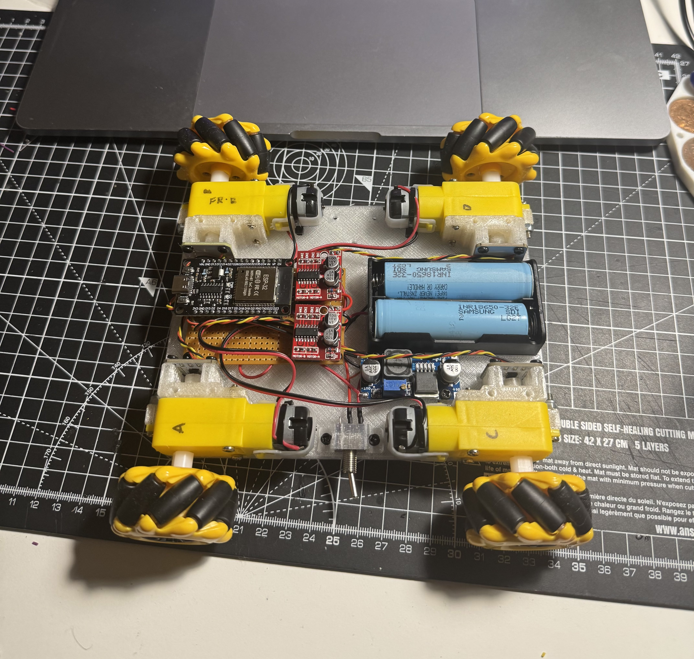

# Mini Mecanum ESP32 Robot - Weekend Project

## Overview

This is a quick 2-day weekend project I built to dive deeper into mecanum wheel kinematics and ESP32 programming. Using inexpensive parts I had lying around, I designed and implemented everything myself - Including the 3D printed frame, perfboard electronics, and embedded programming.
The robot features 4-wheel mecanum drive with full omnidirectional movement capabilities, controlled via a web interface accessible from any device on the same WiFi network. I plan to expand this project in the future with additional sensors and autonomous navigation features - but unfortunately time was limited this weekend. 

## Hardware

- **ESP32 Wroom DevKit** - Main microcontroller with WiFi/BLE capabilities
- **4x DC Motors with mecanum wheels** - 3D printed hubs, inexpensive hobby motors
- **L298N Motor Drivers** - Dual H-bridge drivers for motor control
- **AS5600 Magnetic Encoders** - PWM output mode (more on this below)
- **Power: 2S LIon battery** with basic voltage regulation

## CAD Design

The robot chassis was designed entirely in Fusion 360, featuring a modular design for easy assembly and maintenance. The frame provides stable mounting for all components while keeping the overall footprint compact.

**Key Design Features:**
- **Modular motor mounts** with integrated encoder alignment
- **Central electronics compartment** with ventilation
- **Battery mounting system** with easy access
- **Cable management channels** to keep wiring organized
- **Sensor mounting points** prepared for future LiDAR integration
- **Adjustable wheelbase** for different mecanum wheel sizes

The design prioritizes accessibility - all components can be serviced without disassembling the entire robot. 3D printed parts use PETG filament for durability, with metal inserts for threaded fasteners.

## Photos

### LiDAR Mapping Test
Early testing with RPLiDAR A1 sensor for mapping capabilities:

### AS5600 Encoder Magnet
Diametrically polarized magnet mounted on motor shaft for precise angle detection:

## Software Architecture

### ESP32 Programming Notes

The code leverages several ESP32-specific features:

- **PWM Control**: Using LEDC (LED Control) peripheral for precise motor speed control with 8-bit resolution at 20kHz
- **WiFi & Web Server**: Built-in WiFi stack with asynchronous web server for real-time control
- **OTA Updates**: ArduinoOTA library for wireless firmware updates
- **PWM Encoder Reading**: Utilizing `pulseIn()` for reading PWM signals from AS5600 encoders

## Challenges & Solutions

### AS5600 Encoder Address Conflict Issue

One major challenge I encountered was with the AS5600 magnetic encoders. These sensors use I2C communication, but all AS5600s ship with the same default I2C address (0x36). This creates a bus conflict when trying to use multiple encoders.

**Current Workaround**: Using PWM output mode instead of I2C. The AS5600 can output a PWM signal proportional to the magnetic field angle, which I'm reading with `pulseIn()`. However, this is suboptimal because:
- PWM reading is blocking and less precise than I2C
- Limited update rate compared to I2C mode
- Requires more CPU cycles for processing

**Future Solution**: I've ordered an I2C multiplexer (TCA9548A) to allow multiple AS5600s on the same bus. This will enable proper I2C communication with configurable addresses.

## Web Interface

The robot features a responsive web interface with:
- **Speed control slider** (0-255 PWM)
- **Directional buttons** for basic movement
- **Rotation controls** (CW/CCW)
- **Maneuver buttons** for specific mecanum movements (strafe, diagonal, pivot)
- **Real-time encoder feedback** showing motor positions
- **Mobile-friendly design**

## Future Plans

### Sensor Integration
- **2D LiDAR**: RPLiDAR A1 or similar for mapping and obstacle avoidance
- **IMU**: For orientation tracking and improved odometry
- **Ultrasonic sensors**: Basic proximity detection

### Software Enhancements
- **RTOS**: Move to ESP-IDF with FreeRTOS for better task management
- **ROS Integration**: ROS2 Micro-ROS for advanced robotics framework
- **SLAM**: Simultaneous Localization and Mapping with LiDAR data
- **Path Planning**: A* or similar algorithms for autonomous navigation

### Hardware Improvements
- **Proper motor encoders** with unique addresses
- **Current sensing** for motor load monitoring
- **Battery monitoring** with fuel gauge IC
- **IMU** for dead reckoning

The robot successfully demonstrates all fundamental mecanum movements and provides a solid foundation for future autonomous capabilities.

---

*Built over a weekend in October 2025 - a fun dive into robotics and embedded systems!*